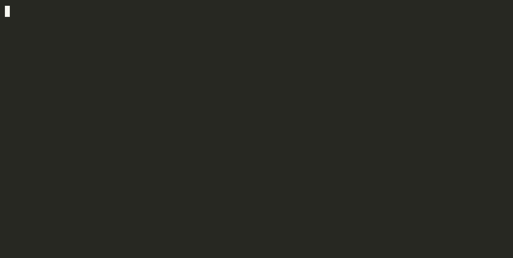

# when-free

**Someone asks when you're free. This reads your calendar and gives you the answer, ready to paste.**

[](https://github.com/YauhenBichel/when-free/actions/workflows/tests.yml)
[](LICENSE)



- **Paste the message, get the slots.** It reads "Tuesday or Wednesday next week, between 10am and 4pm" and answers for exactly those days and hours.
- **Works with Google, Outlook and iCloud** calendars, or any `.ics` file. Several calendars at once.
- **Private.** It runs on your computer, needs no account and no API key, and never changes your calendar.
- **Works from your AI tools too:** Claude, Cursor and other MCP clients, Open WebUI, n8n, Shortcuts, scripts.

## Contents

[Try it](#try-it-in-a-minute) · [Add your calendar](#add-your-calendar) · [Everyday use](#everyday-use) · [Reading a message](#reading-a-message) · [Use it from other tools](#use-it-from-other-tools) · [Privacy](#privacy) · [Settings](#settings) · [What counts as busy](#what-counts-as-busy) · [Limits](#limits) · [Problems](#if-something-does-not-work)

## Try it in a minute

You need Python 3.11 or newer and [uv](https://docs.astral.sh/uv/) (or pipx).

```bash
uv tool install git+https://github.com/YauhenBichel/when-free     # or: pipx install git+https://github.com/YauhenBichel/when-free
whenfree demo
```

`whenfree demo` makes up a calendar for next week and answers a recruiter's message from it. It reads none of your data and saves nothing:

```text
  > Hi! Thanks for applying. Could you share a few times on Tuesday, Wednesday or Thursday next week,
  > between 10am and 4pm? The interview takes about an hour.

  Free between 10:00 and 16:00 (Europe/London), slots of 60+ minutes, 15-minute buffer around events:
  - Tue 13 Oct: 11:45–12:45, 14:15–16:00
  - Wed 14 Oct: 12:15–14:15
  - Thu 15 Oct: 13:15–14:45
```

## Add your calendar

1. **Copy your calendar's private address.** It's a link that ends in `.ics`:

   | Calendar | Where to find it |
   |---|---|
   | Google Calendar | [Settings](https://calendar.google.com/calendar/u/0/r/settings) → click your calendar on the left → *Integrate calendar* → **Secret address in iCal format** |
   | Outlook | Settings → Calendar → Shared calendars → *Publish a calendar* → the **ICS** link |
   | iCloud | Calendar → the share icon next to the calendar → *Public Calendar* (a `webcal://` link is fine) |
   | Anything else | Any `.ics` link, or an exported `.ics` file |

2. **Run `whenfree add` and paste it.** The address isn't shown while you paste. It's checked first, and saved only if it works:

   ```console
   $ whenfree add
   Paste the address and press Enter (it is not shown):
   Added 'personal': 412 events, 9 block time in the next 14 days.
   Saved in /Users/you/.config/when-free/config.toml, readable only by you. Now run: whenfree
   ```

3. **Run `whenfree`.** You'll see your free time for the next working days.

On a Mac, `pbpaste | whenfree add` takes the address straight from the clipboard.

> **Keep the address secret.** It works like a password: anyone who has it can read that calendar. Give it to `whenfree add` and to nothing else, so not to a chat, a shell command or a repository. If it leaks, reset it in your calendar's settings.

<details>
<summary><b>Google Calendar, step by step</b></summary>

Do this in a browser, because the phone app doesn't show the address.

1. Open [Google Calendar settings](https://calendar.google.com/calendar/u/0/r/settings): the gear icon, then **Settings**.
2. In the left column, under **Settings for my calendars**, click the calendar you want. The one with your own name is where invitations arrive.
3. Scroll down to **Integrate calendar** and copy **Secret address in iCal format**. It ends in `basic.ics`. Don't take "Public address in iCal format", which only works for a calendar you've made public.
4. Run `whenfree add` and paste it when asked.

No "Secret address"? Work and school accounts can have it switched off. Export the calendar instead (Settings → Import & export → Export), unzip it, and run `whenfree add ~/calendars/work.ics`. An export is a snapshot, so export again when your calendar changes.
</details>

<details>
<summary><b>More than one calendar</b></summary>

A slot counts as free only if it's free in every calendar you add.

```bash
whenfree add --name work                 # a second calendar: asks for its address
whenfree add ~/calendars/family.ics      # an exported file instead of an address
whenfree check                           # can every calendar be read?
```

They're kept in `~/.config/when-free/config.toml`, one `[[calendar]]` block each, with a `name` and a `url` or `path`. You can edit that file by hand. `whenfree init` creates an empty one.
</details>

## Everyday use

| You want | Run |
|---|---|
| Your free time over the next working days | `whenfree` |
| The days and hours a message asks about | `pbpaste \| whenfree --message -` (Mac clipboard) or `whenfree --message invite.txt` |
| Next week's afternoons | `whenfree --days "next week" --hours afternoon` |
| Specific days | `whenfree --days "Thu 15 Oct, Fri 16 Oct"` |
| A date range | `whenfree --from 2026-10-12 --to 2026-10-16` |
| Only slots long enough for a 90-minute meeting | `whenfree --min 90` |
| To see what blocks each day | `whenfree --busy` |
| The answer in another time zone | `whenfree --tz America/New_York` |
| JSON for a script | `whenfree --format json` |
| To copy the answer | `whenfree ... \| pbcopy` (only the slot lines are copied) |

Only the slot lines go to standard output. The context goes to standard error, so `| pbcopy` copies exactly what you'd paste into a reply.

## Reading a message

`--message` finds the days and hours in ordinary text. It understands:

- **Dates** written in any common way: `Thu 1 Oct` · `Thursday the 1st of October` · `Monday, October 5th` · `5 October` · `2026-10-05` · `Wednesday 30th`
- **Hours:** `between 10:00am and 4:00pm` · `10:00–16:00` · `9-5pm` · `2 to 4 pm`
- **Words, when there's no date** (here, today is Thursday 1 Oct):

| Written | Read as |
|---|---|
| `today` · `tomorrow` · `the day after tomorrow` | Thu 1 · Fri 2 · Sat 3 Oct |
| `Thursday or Friday` | the coming ones, today included: Thu 1, Fri 2 Oct |
| `this Tuesday` · `next Tuesday` | Tuesday of this week (already past, so left out and named) · Tuesday of next week, Tue 6 Oct |
| `next week` · `this week` · `the week after next` | that week's working days, from today on |
| `Tuesday or Wednesday next week` | Tue 6, Wed 7 Oct |
| `any afternoon` · `Friday morning` · `evening` | 12:00–17:00 · 09:00–12:00 · 17:00–20:00, unless hours are given |

It always tells you how it read the dates, so you can check them against the message. A few rules keep it from guessing:

- **Explicit dates win.** A heading like "Next week:" above "Wednesday 30th, Thursday 1st" doesn't add a whole week.
- **"Good morning" is a greeting**, not a time.
- **Days already past are left out** and named, never dropped silently. "Wednesday 30th" means the nearest Wednesday that's a 30th, so a message from last week reads as last week.
- **Words count from today.** For an older message that says "tomorrow", give the days yourself with `--days`.

when-free never connects to your mailbox. You paste the message, pipe it in, or save it to a file.

<details>
<summary><b>Let your own language model read the message</b></summary>

If you run a model yourself, it can do the reading instead. Add this to the settings file:

```toml
[extract]
command = ["ollama", "run", "llama3.2"]          # the prompt is sent on standard input
# command = ["my-cli", "ask", "{prompt}"]        # or placed where {prompt} is
```

The command receives the message and must print JSON: `{"days": ["2026-10-05"], "hours": "10:00-16:00", "minutes": 60}`. If it fails, pattern matching is used instead. Nothing runs unless you configure it, and `--no-extract` skips it for one run. The message goes to whatever that command talks to, so use a local model for private text.
</details>

## Use it from other tools

Every way gives the same answer, only reads, and leaves event titles out unless asked.

| Your tool | Use | Set up |
|---|---|---|
| Claude Code, Claude Desktop, Cursor, VS Code, any MCP client | [MCP server](#mcp-claude-cursor-and-other-assistants) | one line |
| Open WebUI, n8n, Shortcuts, Raycast, anything that calls a URL | [Local HTTP server](#http-open-webui-n8n-shortcuts-and-scripts) | `whenfree serve` |
| Your own agent with function calling | [Schema and call](#function-calling-harnesses) | two commands |
| Python | [The library](#python) | `import whenfree` |

### MCP: Claude, Cursor and other assistants

```bash
claude mcp add when-free -- whenfree mcp          # Claude Code
```

For Claude Desktop, Cursor and other MCP clients, add this to their server list:

```json
{
  "mcpServers": {
    "when-free": { "command": "whenfree", "args": ["mcp"] }
  }
}
```

Then just ask: *"Here's the recruiter's message. Which of those times can I do?"* The assistant calls `free_slots` and answers from your real calendar.

| Tool | What it does |
|---|---|
| `free_slots` | Free time per day. Takes `days`, or `from` and `to`, or a `message`, plus `hours`, `min_minutes`, `buffer_minutes`, `timezone`, `weekends`, `all_day_busy`, `include_busy` |
| `check_calendars` | Whether each calendar can be read, with event counts. No details, no addresses |

If a tool can't do its job, the assistant gets an error it can read ("could not read the calendar 'work'"), never a guess.

### HTTP: Open WebUI, n8n, Shortcuts and scripts

```bash
whenfree serve                    # http://127.0.0.1:8765, only reachable from this computer
```

```bash
curl -H "Authorization: Bearer $(cat ~/.config/when-free/token)" \
  'http://127.0.0.1:8765/free_slots?days=next%20week&hours=afternoon'
```

- `POST /free_slots` with a JSON body, or `GET` with a query string. Same for `/check_calendars`.
- The answer is `{"ok": true, "text": "...", "data": {...}}`, or `{"ok": false, "error": "..."}` with status 400.
- **OpenAPI** description at `/openapi.json`. In Open WebUI, add `http://127.0.0.1:8765` as an OpenAPI tool server, with the token as the bearer key.
- **The token** is created on first run and kept in `~/.config/when-free/token`, readable only by you. Or set your own with `WHENFREE_TOKEN`. Every tool call needs it.
- Requests addressed to any host other than this computer are refused. A web page may call it only from an origin you allow: `whenfree serve --allow-origin http://localhost:3000`.

### Function-calling harnesses

```bash
whenfree schema                    # the tool definitions: name, description, inputSchema
whenfree schema --format openai    # the same, as {"type": "function", "function": {...}}
whenfree call free_slots --args '{"days": "next week", "hours": "10:00-16:00"}'
```

`whenfree call` prints `{"ok": true, "text": "...", "data": {...}}`, or `{"ok": false, "error": "..."}` with exit code 1. Arguments can also come on standard input.

### Python

```python
from whenfree import api

result = api.find_free(api.Query(days="next week", hours="10:00-16:00", min_minutes=45))
for day in result["days"]:
    print(day["label"], day["free"])          # for example: Mon 12 Oct [['10:00', '11:45'], ['13:15', '16:00']]
```

`find_free` returns plain dicts and lists, ready for `json.dumps`, and raises `api.Problem` with a message that's safe to show. Pass `reader=` to supply calendar text yourself instead of fetching it.

## Privacy

- **It runs on your computer.** It fetches your calendar feeds and nothing else. It never writes to a calendar and never sends a message.
- **Your calendar address stays secret.** It's never printed, isn't shown while you paste it, and is stored in a file only you can read. Errors name the calendar ("personal"), never its address.
- **Assistants see free time, not your events.** Event titles are left out unless the assistant asks with `include_busy`, and that option's description tells the model that titles are private. No tool can add, change or delete anything, and no tool takes a calendar address, which goes from you to `whenfree add` only.

## Settings

All optional except a calendar. They live in `~/.config/when-free/config.toml`, and command-line flags win over the file.

| Setting | Default | Flag | Meaning |
|---|---|---|---|
| `timezone` | your system's | `--tz` | The zone the answer is given in, like `Europe/London` |
| `hours` | `09:00-18:00` | `--hours` | The part of the day you offer. Also `morning`, `afternoon`, `evening` |
| `min_minutes` | `60` | `--min` | Shortest slot worth offering |
| `buffer_minutes` | `15` | `--buffer` | Kept free before and after every event |
| `weekends` | `false` | `--weekends` | Include Saturday and Sunday in a date range |
| `all_day_busy` | `false` | `--all-day-busy` | Whole-day events block the day |
| `days_ahead` | `7` | | Working days shown when you give no dates |
| `me` | `[]` | | Your email addresses, so invitations you declined don't block |
| `[[calendar]]` | | `--calendar` | `name` and `url` or `path`. One block per calendar; `whenfree add` writes them |
| `[extract] command` | none | `--no-extract` | A command that reads a message with your own model |

<details>
<summary><b>Environment variables</b></summary>

For scripts, containers and MCP client configurations. All optional.

| Variable | Meaning |
|---|---|
| `WHENFREE_CALENDARS` | Comma-separated calendar addresses or paths. Replaces the file's list. **Sensitive**: see below |
| `WHENFREE_CONFIG` | Path to the settings file |
| `XDG_CONFIG_HOME` | Where the settings file is looked for when `WHENFREE_CONFIG` isn't set: `$XDG_CONFIG_HOME/when-free/config.toml`, otherwise `~/.config/when-free/config.toml` |
| `WHENFREE_TZ` | The zone the answer is given in. Wins over `timezone` in the file |
| `TZ` | Your system's zone, used when neither of the above gives one |
| `WHENFREE_TOKEN` | The token for `whenfree serve`, instead of the token file. **Sensitive** |
| `WHENFREE_NOW` | An ISO date-time to use as "now", so a run can be reproduced |

**`WHENFREE_CALENDARS` holds passwords.** A private calendar address lets anyone who has it read that calendar. Treat the variable like an API key: keep it out of shared shell profiles, committed MCP configurations, CI logs and screenshots. The settings file `whenfree add` writes is readable only by you, so use it instead where you can.
</details>

## What counts as busy

| In your calendar | Blocks time? |
|---|---|
| An ordinary event | Yes, plus the buffer on both sides |
| An event marked **Free** | No |
| A cancelled event | No |
| An invitation you declined (your address in `me`) | No |
| A whole-day event | No, unless `all_day_busy = true`. Then yes, unless it's marked Free |
| A repeating event | Each occurrence, with skipped dates skipped and moved ones where they were moved to |

A slot shorter than `min_minutes` after the buffers isn't offered. For today, the day starts at the next quarter hour, not in the past.

## Limits

- **It reads; it doesn't book.** It never writes to a calendar and never sends a message.
- **It's as fresh as the feed.** Google refreshes the secret address with some delay, so an event added a minute ago may be missing. Run `whenfree --busy` to see what it saw.
- **Every calendar or none.** If one calendar can't be read, no slots are shown, because busy time would look free.
- **Repeating events.** Daily, weekly, monthly (by date, or "first Monday", "last Friday") and yearly rules are expanded, with intervals, end dates, counts, skipped dates and moved occurrences. Rarer rules (`BYSETPOS`, week numbers) aren't. For those the first date is blocked and a note says so.
- **Time zones** come from the events. A zone name the time zone database doesn't know (some Outlook exports) is read in your own zone.

## If something does not work

| What you see | What to do |
|---|---|
| `No calendar is configured` | Run `whenfree add`. If you edited the file by hand, the `url` line is still empty or the file wasn't saved; the message names the file |
| `could not read the calendar 'personal' (...)` | The address is incomplete or isn't the secret one; the message says which when it can tell. Copy it again with the copy button |
| `returned a web page, not a calendar` or `did not return iCalendar data` | That link isn't a calendar feed. It should end in `.ics` |
| `Nothing was saved` | `whenfree add` couldn't read the calendar, so nothing changed. Fix the address and run it again |
| No "Secret address" in Google's settings | Your organisation switched it off. Export the calendar instead: see [Google Calendar, step by step](#add-your-calendar) |
| An event you just added is missing | The feed refreshes with a delay. See [Limits](#limits) |
| A meeting doesn't block time | Run `whenfree --busy` to see what was read. Declined invitations, events marked Free and whole-day events don't block; see [What counts as busy](#what-counts-as-busy) |
| `whenfree check` | Says whether every calendar can be read, at any time |

## Development

```bash
uv run --with pytest pytest -q        # a few seconds; no network
```

The tests use a small calendar in `tests/data/sample.ics` and a fixed clock (`WHENFREE_NOW`). The code is laid out as:

| Module | Job |
|---|---|
| `api` | `find_free`: plan the query, choose the days, read busy time, work out each day |
| `dates` | Read days and hours out of text |
| `sources` | Read calendars from an address or a file |
| `ical`, `slots` | Parse events, expand repeats, turn busy time into free slots |
| `render` | Word the answer, the same way for every front end |
| `tools` | The tools offered to agents: one registry entry each |
| `cli`, `mcp`, `server`, `demo` | The front ends |

See [CONTRIBUTING.md](CONTRIBUTING.md).

## Licence

Apache-2.0.
